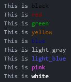

#Colorizr
Colorize any string that is output to the command terminal

##Features
###Methods for adding color to any string
* `black`
* `red`
* `green`
* `yellow`
* `blue`
* `light_gray`
* `light_blue`
* `pink`
* `white`

###Additional String methods
* `String.colors` - Lists all colors available
* `String.sample_colors` - Demonstrates all colors available



##Installation
* Download this repository
* Install the gem by running the following command:
```
gem install colorizr-0.0.2.gem
```
* At the top of the file you wish to use it with be sure to add:
```
require 'colorizr'
```

###Built with
*Ruby*

###Author
Suzanne Kozina

##Acknowledgements
Many thanks to the Udacity Ruby Content Team for providing exceptional learning tools that made it possible for me to find my way in creating my first Ruby gem.
###License
This project is licensed under the MIT License. See [LICENSE.txt](LICENSE.txt) file.
